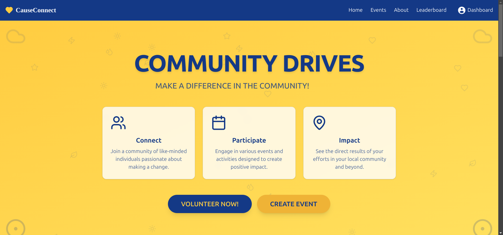

# CauseConnect
Cause Connect is a web application that helps users find and connect with volunteer opportunities organized by local NGOs and community initiatives. The app aims to bridge the gap between volunteers and organizations, allowing for easy event discovery, registration, and participation.

YouTube link - https://youtu.be/loH2dCFAVb4?si=GHSRxwNOKR0hLQfx

# Table of Contents
Features
Tech Stack
Getting Started
Prerequisites
Installation
Environment Variables
Running the App
API Endpoints
Folder Structure
Future Improvements
License
Features

Event Discovery: Browse and search for volunteer events in your area.
User Authentication: Sign up, log in, and secure access with JWT authentication.
Event Registration: Register for events, view past events, and receive event updates.
Organizer Dashboard: NGOs and organizations can create, update, and manage events.
Pagination and Loading Effects: Smooth and dynamic pagination for events, with loading indicators for a seamless experience.
Tech Stack
Frontend: React, TypeScript, Tailwind CSS, Daisy UI
Backend: Node.js, Express.js
Database: MongoDB (using MongoDB Atlas)
Authentication: JSON Web Tokens (JWT)
Map Integration: OpenStreetMap for location display

# Getting Started
Prerequisites
-Node.js (v14 or higher)
-MongoDB Atlas account and cluster (or a local MongoDB instance)

Installation
Clone the repository:

[git clone https://github.com/anuj846k/cause-connect.git](https://github.com/anuj846k/CauseConnect)

cd cause-connect

Install dependencies for both frontend and backend:

cd backend
npm install
cd ../frontend
npm install

# Environment variables
Create a .env file in the root of the backend folder and add the following variables:

MongoDB connection string
DATABASE_URL=mongodb+srv://<username>:<password>@cluster0.mongodb.net/<your-database>?retryWrites=true&w=majority

JWT Secret
JWT_SECRET=your_jwt_secret_key
JWT_EXPIRES_IN=90d

Other configurations
PORT=5000
Running the App
Start the backend server:

bash
Copy code
cd backend
npm run dev
Start the frontend development server:

bash
Copy code
cd ../frontend
npm start
Open http://localhost:3000 in your browser to view the app.

# Future Improvements
In-app virtual assistant: to suggest event ideas and autofill forms
In-app Messaging: Enable direct communication between volunteers and organizers.
Notifications: Send reminders and updates for upcoming events.
